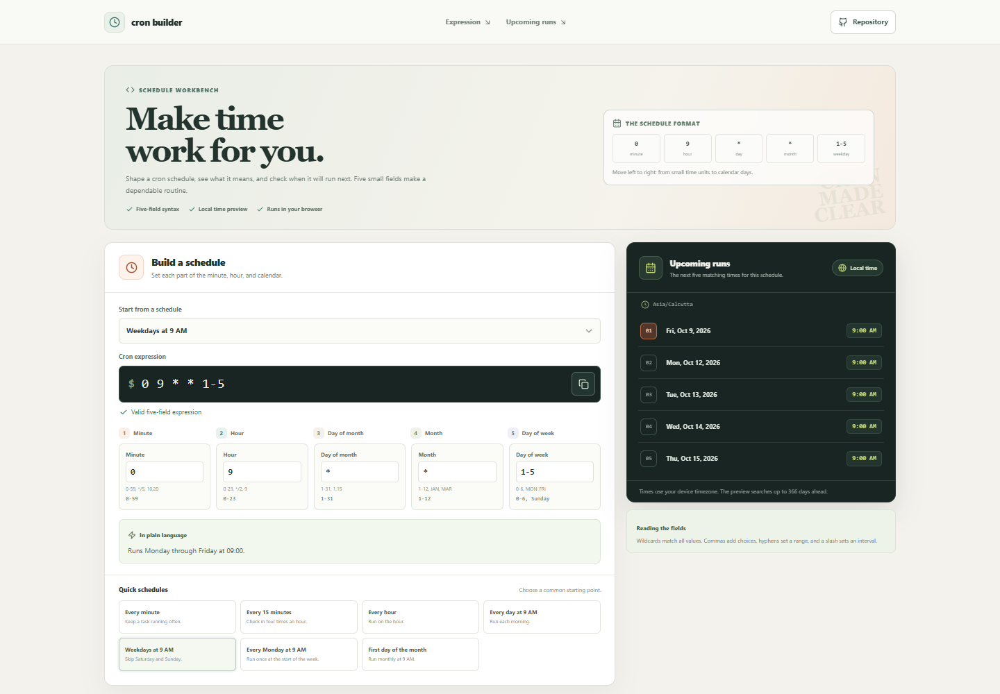

# Cron Expression Builder

A browser-based utility for composing five-field cron expressions, checking their syntax, and reading their upcoming run times.

## Local setup

```sh
npm install
npm run dev
```

The build uses Vite with a project-site base path and npm deployment scripts. The finished feature guide and deployment details will be added with the completed app.
